# wittgenstein-NLTK-TLF
NLTK and bash quantitative parsing of TLF

## 1. Software necesario (win10)

- python 3.8
- pip install -U nltk
- ejecutar 
  - import nltk
  - nltk.download() -- ALL
- pip install -U numpy
- pip install -U matplotlib
- pip install scipy

Se puede echar un vistazo a:
		
https://answers.microsoft.com/en-us/windows/forum/all/microsoft-visual-c-140/6f0726e2-6c32-4719-9fe5-aa68b5ad8e6d

https://www.scivision.dev/python-windows-visual-c-14-required/

## 2. Wittgenstein (tractatus logico-philosophicus)

No necesita presentación. 
Se ha definido el GRADO de un aforismo del texto, es igual a la cantidad de cifras tras el "." que aparece en la indexación de los aforismos: 

El aforismo 2.21 (por ejemplo) tiene GRADO = 2. 
El aforismo 6 tiene GRADO = 0
El aforismo 3.121 tiene GRADO = 3

## 3. Ficheros de input

Se adjuntan los ficheros de input utilizados. En el [directorio dat](dat)  

El tratactus en ingles
El tratactus en español

Para cada una de estas versiones se incluyen subdirectorios donde el texto se ha separado:

- Por capítulos
- Por grados

El texto tiene 7 capítulos. Los capítulos 1 y 7 son triviales ó muy escuetos. 

El texto tiene aforismos de grado entre 0 y 5 (muy pocos con grado 5)

# bash

## 1. Longitud de los aforismos

el fichero *trad.1.txt* es el tratactus en ESP

La longitud promedio de los aforismos del tratado (ESP) es:

~~~

cat trad.1.txt |awk '{sub(/[^ ]+ /, ""); print $0}'> kk  ; tr -d [:punct:] < kk >temp1.txt 

tr [:upper:] [:lower:] < temp1.txt > temp2.txt ; tr [:upper:] [:lower:] < temp1.txt > temp2.txt 

cat 1.trad.norm.txt | while read line; do count=$(echo $line | wc -c); echo $count $line |awk '{print $1}'; done > num_char_perLine.1.txt 

cat num_char_perLine.1.txt |awk '{sum+=$1} END { print "Average = ",sum/NR}' 

~~~

**Average = 230.156**

La longitud de un aforismo promedio es 230 caracteres.

## 2. Cuantos aforismos de cada GRADO

¿Cuantos aforismos hay de cada grado? 

~~~

cat trad.1.txt | awk '{print $1}'| awk -F. '{print $1 "-" $2 "-" length($2)}'> grado.trad.1.txt

for i in {0..5}; do awk -v var=$i -F- '{if($3==var)print $0}' grado.trad.1.txt | wc -l  ; done

~~~

- 7
- 25
- 124
- 245
- 118
- 7

Para cada uno de los grados  {0,1,...5}

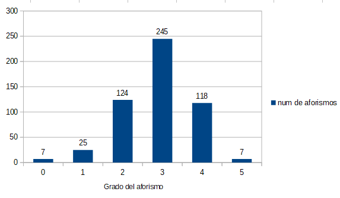

## 3. Longitud por GRADOS

La longitud promedio de los aforismos según su grado:

~~~
paste -d"-" grado.trad.1.txt num_char_perLine.1.txt > grado_char1.txt

for i in {0..5}; do awk -v var=$i -F- '{if($3==var)print $4}' grado_char1.txt |awk '{sum+=$1} END { print "Average_Por_grado = ",sum/NR}'   ; done

~~~

Y se obtiene:

grado_0 =  69.1429  
grado_1 =  164.04  
grado_2 =  195.597  
grado_3 =  243.547  
grado_4 =  257.703  
grado_5 =  279.857  

Cuanto mayor es el grado, mayor es la longitud del aforismo

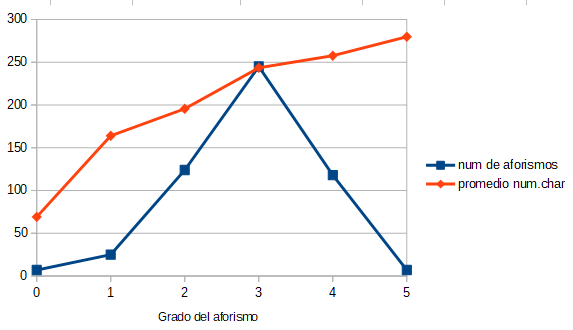

# NLTK

## 1. Aforismos mónicos

Se sustituye la ruta donde residen los aforismos (en inglés) del siguiente script:

~~~

import nltk
from nltk.corpus import PlaintextCorpusReader
corpus_root = r'C:\Users\guille\Google Drive\NLTK\NLTK\tratactus\eng_tratactus\afo'
newcorpus = PlaintextCorpusReader(corpus_root, '.*')
tokens = nltk.word_tokenize(newcorpus.raw())
words = newcorpus.words()
words = [word.lower() for word in words]
for fileid in newcorpus.fileids():
 num_chars = len(newcorpus.raw(fileid))
 num_words = len(newcorpus.words(fileid))
 num_sents = len(newcorpus.sents(fileid))
 print (num_chars , num_words, num_sents, fileid)

~~~

Se obtiene un CSV así:
~~~
num_chars  num_words num_sents   fileid  
56 		15 	1  	1.1.txt  
78 		19  	1  	1.11.txt  
96 		22  	1  	1.12.txt  
48 		12  	1  	1.13.txt  
35 		9   	1  	1.2.txt  
88 		20  	1  	1.21.txt  
37 		10  	1  	1.txt  
83 		21  	1  	2.01.txt  
97 		19  	1  	2.011.txt  
162     	35  	1  	2.012.txt  
707    		136  	6  	2.0121.txt  
285     	58  	2  	2.0122.txt  
214     	44  	3  	2.0123.txt  
~~~
Que contiene para cada aforismo: 
numero de caracteres, numero de palabras, numero de frases, y el fileid (que identifica al aforismo en cuestión)

Si llamamos al fichero resultante (por ejemplo) kk.txt
~~~
awk 'NF>0' kk.txt > kk.txt.bueno; mv kk.txt.bueno kk.txt

totales=`wc -l kk.txt | awk '{print $1}'` ;  monicos=`awk '$3==1' kk.txt | wc -l` ; awk "BEGIN {print $monicos/$totales}"
~~~

**0.441634**

Es decir, el 44% de los aforismos del texto contienen un sola sentencia.

Si vemos el % de aforismos mónicos según su capítulo:

~~~
for j in {1..7}; do cat kk.txt | awk '{print $4}' | awk -v var=$j -F"." '$1==var' | wc -l ; done > totales
	
for i in {1..7}; do cat kk.txt | awk '$3==1' | awk '{print $4}' | awk -v var=$i -F"." '$1==var'  | wc -l ; done > parciales

paste totales parciales > kk
	
awk '{print "% de aforismos mónicos. Capítulo "NR"  " $2/$1}' kk
~~~

% de aforismos mónicos. Capítulo 1  1  
% de aforismos mónicos. Capítulo 2  0.818182  
% de aforismos mónicos. Capítulo 3  0.478873  
% de aforismos mónicos. Capítulo 4  0.311321  
% de aforismos mónicos. Capítulo 5  0.358108  
% de aforismos mónicos. Capítulo 6  0.346154  
% de aforismos mónicos. Capítulo 7  1  

**El texto es lacónico a más no poder**

Si calculamos los aforismos mónicos (su %) a tenor del grado del aforismo:

tomando el grado > 1:

~~~
for i in {1..5}; do awk -F"." 'NF>2' kk.txt | awk -v var=$i -F"." '{ if (length($2) == var) print $0}' > grado_$i.txt ; done

for k in {1..5}; do cat grado_$k.txt > kk 
 for j in {1..7}; do cat kk | awk '{print $4}' | awk -v var=$j -F"." '$1==var' | wc -l ; done 	> totales
 for i in {1..7}; do cat kk | awk '$3==1' | awk '{print $4}' | awk -v var=$i -F"." '$1==var'  | wc -l ; done	> parciales
 paste totales parciales	> subtot
 awk -v var=$k '{if( $1 + 0 != 0) print "% de afo. de 1 sentencia. Para el GRADO="var" ___Capítulo "NR"  " $2/$1}' subtot
done
~~~

Que devuelve unos datos curiosos:

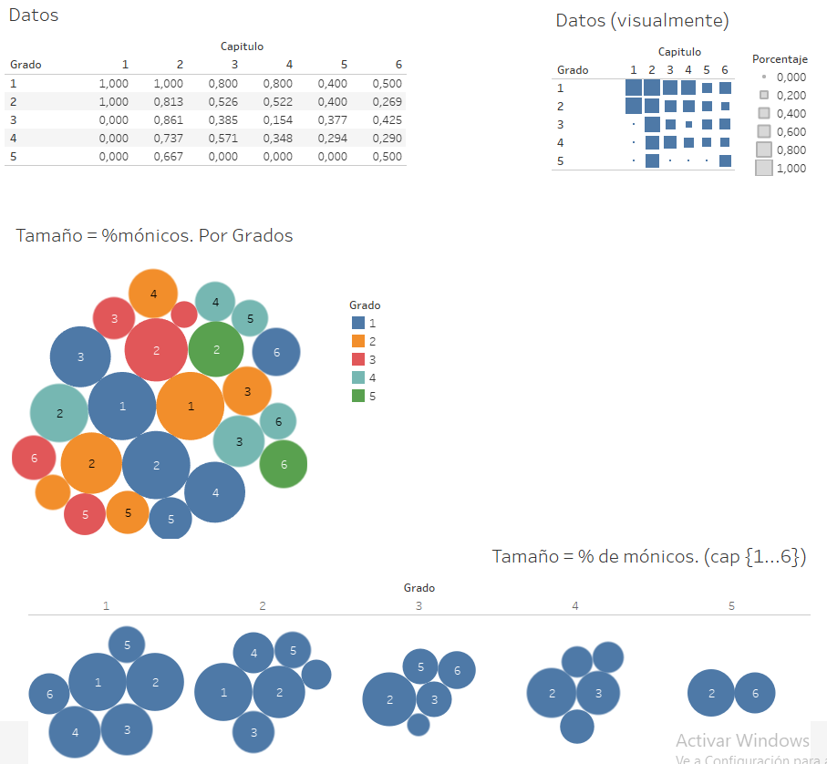

Complementariamente a lo que se obtenía antes (los aforismos son mas largos cuanto mayor es su grado) aquí se observa que en los grados 3 y 4 los aforismos tienden a ser en menor proporción mónicos.

El capítulo 5 es el que menor proporción tiene mónicos. (en Datos (visualmente))

## 2. Longitud or capítulos

Se ejecuta sobre el CSV del apartado 1:

~~~
for i in {1..7}; do tr . ' ' < num_char.txt | awk -v var=$i '{if($4==var)print $1}' | awk '{sum+=$1} END { print "Average_Por_cap = ",sum/NR}' ; done
~~~
 
Average_Por_cap =  62.5714  
Average_Por_cap =  118.818  
Average_Por_cap =  201.296  
Average_Por_cap =  300.726  
Average_Por_cap =  270.561  
Average_Por_cap =  268.846  
Average_Por_cap =  59  

Siendo la media del texto completo 230, solamente la segunda mitad del libro es ligeramente mayor

## 3. Palabras mas frecuentes

Se ejecuta:

~~~
import nltk, string
from nltk import FreqDist
f = open('en.tratactus.txt', encoding="utf8")
raw = f.read()
tokens = nltk.word_tokenize(raw)
text = nltk.Text(tokens)
words = [w.lower() for w in tokens]
stopwords = nltk.corpus.stopwords.words('english')
stopwords.append('The')
stopwords.append('p')
stopwords.append('q')
stopwords.append('A')
stopwords.append('I')
stopwords.append('If')
stopwords.append('In')
stopwords.append('It')
stopwords.append('x')
stopwords.append('And')
fdist = FreqDist(text)
# Freq Dist de palabras
fdist_no_punc_no_stopwords = nltk.FreqDist(dict((words, freq) for words, freq in fdist.items() if words not in stopwords and words.isalpha()))
fdist_no_punc_no_stopwords.plot(20, cumulative=True, title="Términos más utilizados")
fdist_no_punc_no_stopwords.plot(20, cumulative=False, title="Términos más utilizados")
# wordcloud
import matplotlib.pyplot as plt
from wordcloud import WordCloud
wc = WordCloud().generate(' '.join(words))
plt.imshow(wc, interpolation='bilinear')
plt.axis("off")
plt.show()
~~~

Y se pueden ver como:

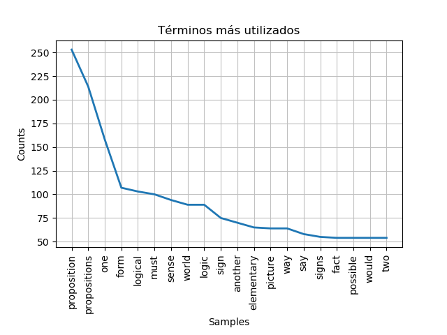  

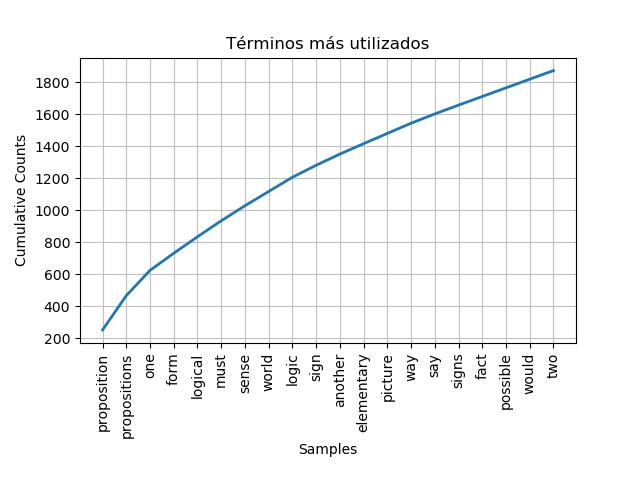  

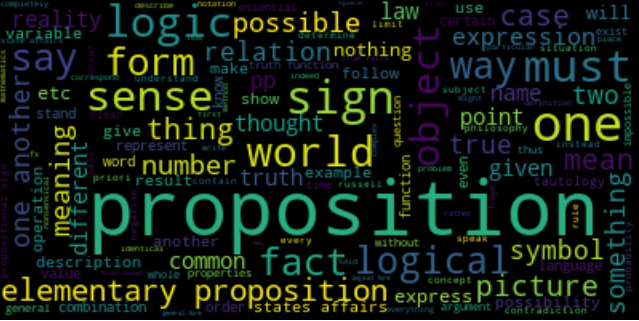  

## 4. Dispersion de términos

Se ejecuta:

~~~
text.dispersion_plot(["proposition","picture","true"])
text.dispersion_plot(["proposition","world","true"])
text.dispersion_plot(["logical","fact","formal"])
~~~

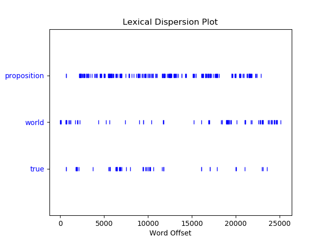  

*Proposición* parece ser un término que se menciona densa y uniformemente a lo largo de todo el texto. No sólo es el que aparece con mayor frecuencia, es que está diseminado a lo largo del texto. 

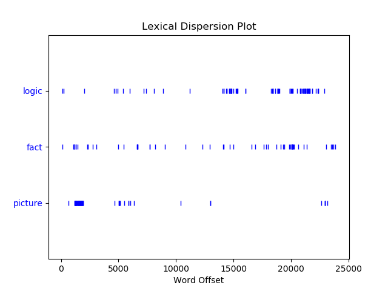  

*Imagen* o *escena* (como es sabido que el autor llama en varias ocasiones a la materia constitutiva del pensamiento) es mencionada, sobre todo, en la parte inicial del texto. 

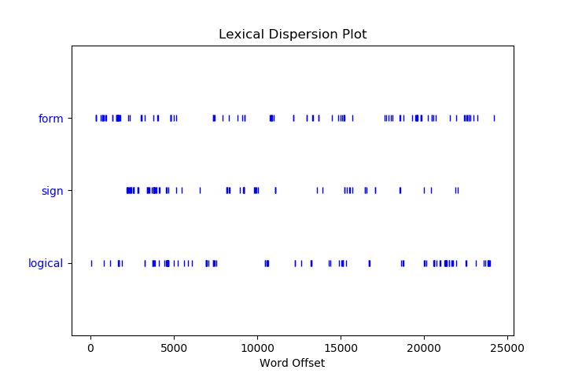  

## 5. Diversidad léxica 

La diversidad léxica se refiere al número de palabras diferentes utilizadas en un texto en relación a la longitud del mismo. Un rango mayor indica una diversidad mayor para una misma longitud textual.

Se ejecuta el [script](src/tract_div_lexi_grado2.py)

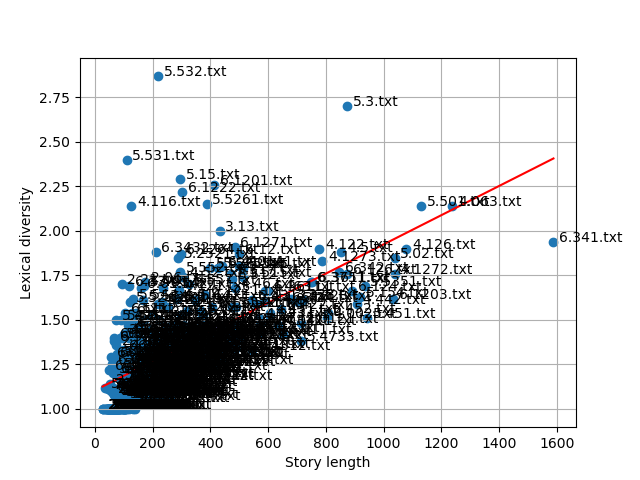  

La linea de regresión muestra que el texto no es literario, pues está ligeramente escorada hacia el eje *Story Length*

Si se calcula la diversidad lexica segun los diferenetes capítulos (se cambia la ruta que toma el script como INPUT):

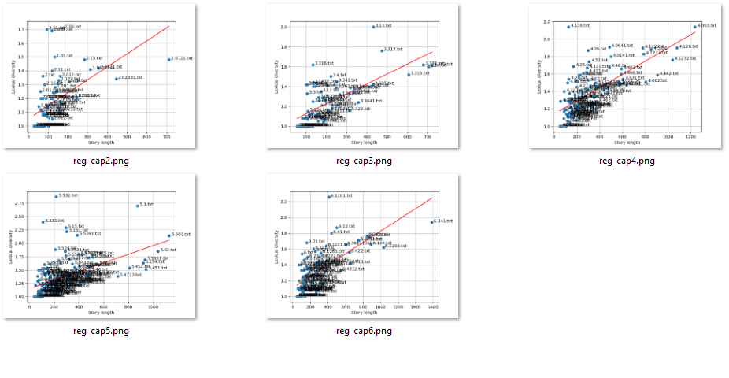  

Los capítulos 3 y 5 son los que menos diversidad muestran.

Si se calcula la diversidad léxica para los grados (IDEM. Se cambia la ruta que toma el script como INPUT)

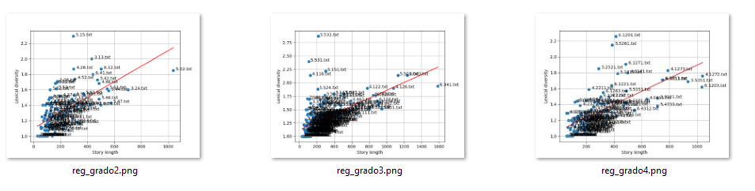  

Recuérdese que a mayor grado, mayor longitud de los aforismos. El diagrama del grado_3 muestra que es el más diverso (el indicador alcanza 2.30)

## 6. Densidad léxica 

La densidad léxica se entiende como la relación entre el total de palabras léxicas -o de contenido semántico- (verbos, nombres, adjetivos y algunos adverbios) comparado con las llamadas palabras gramaticales -o funcionales- (artículos, preposiciones, conjunciones, entre otros)

Se ejecuta el [script](src/tract_dens_adv.py)

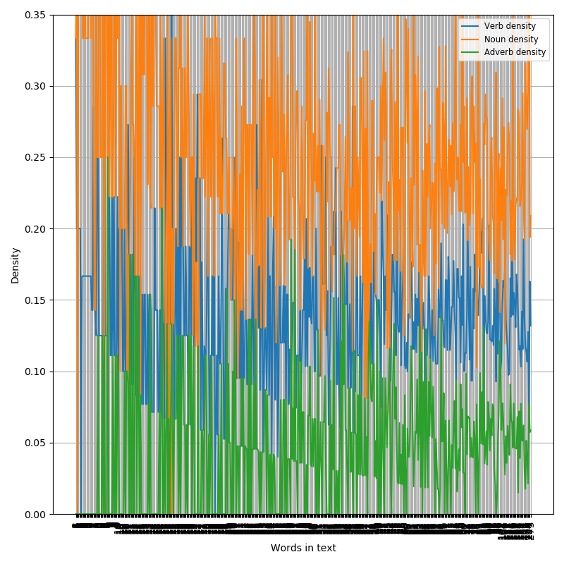  

O bien [este otro script](src/tract_dens_adj.py) para el caso de los adjetivos.

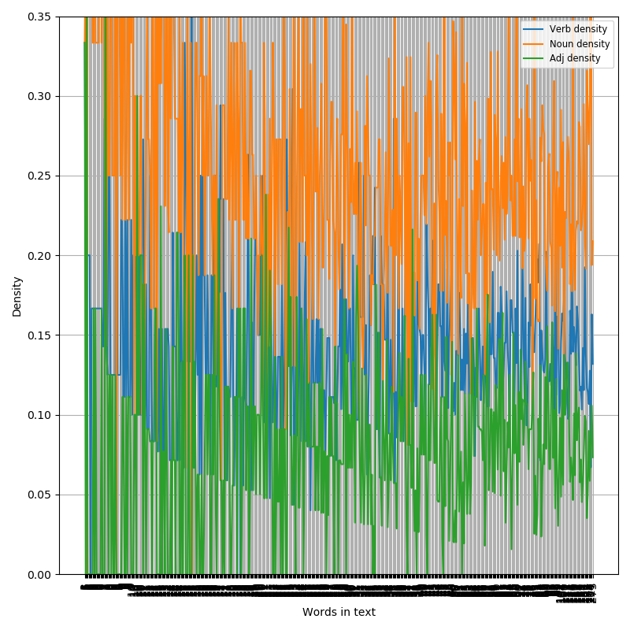  

Se evidencia que los *nombres* son los léxicos mas frecuentes en el texto. Cambiando la ruta INPUT en el script se puede obtener el cálculo bien por capítulos ó bien por grados.

En concreto puede calcularse que existen el doble de nombres que de verbos, aunque casi los mismo adjetivos que adverbios (indicando, una vez más, lo poco enfático o literario del texto, que usa los nombre como *conceptos* sin adjetivaciones)

Si se ejecuta [el siguiente script](src/tract_mas_dens.py) se obtiene:

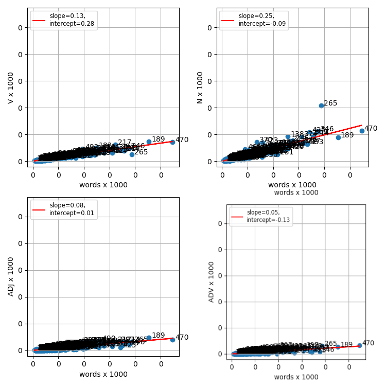  

## 7. Categorías gramaticales (parts of speech)

Para el cálculo de las proporciones que las principales categorías significativas (N, V, ADV, ADJ) tienen entre ellas, se ejecuta el script de [parts of speech](src/part_speech.py)

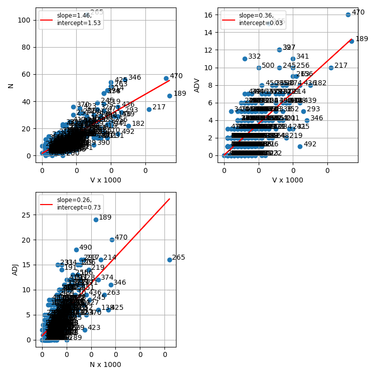  

## 8. Sinónimos o similares

Ejecutemos sobre el texto en español [lo siguiente](src/sin_sim.py):

~~~
import nltk
from nltk.corpus import PlaintextCorpusReader
corpus_root = r'C:\Users\guille\Google Drive\NLTK\DEF\ficheros_in\Tratactus\esp\afo'
from nltk import FreqDist
newcorpus = PlaintextCorpusReader(corpus_root, '.*')
tokens = nltk.word_tokenize(newcorpus.raw())
text = nltk.Text(tokens)
stopwords = nltk.corpus.stopwords.words('spanish')
fdist = FreqDist(text)
fdist_no_punc_no_stopwords = nltk.FreqDist(dict((word, freq) for word, freq in fdist.items() if word not in stopwords and word.isalpha()))
~~~

Se puede consultar la similitudes de determinados términos como:

~~~
text.similar("proposición")
~~~
figura realidad lógica forma operación tautología filosofía
descripción expresión negación probabilidad cosa ley contradicción red
verdad matemática mecánica serie que
~~~
text.similar("mundo")
~~~
objeto signo caso que espacio sentido lenguaje darse complejo
pensamiento símbolo número modo contrario yo otro índice ámbito
procedimiento ojo
~~~
text.common_contexts(["proposición","figura"])
~~~
la_se la_es la_pertenece la_con la_no la_el la_que la_la la_tiene
una_en la_determina una_de la_y una_del la_representa la_puede
la_porque una_como una_el toda_es
~~~
text.common_contexts(["lenguaje","mundo"])
~~~
el_el del_el el_no del_que

Y, por ejemplo, para algunos casos aparecidos, ver su diseminación a los largo del texto:

Tomaremos por ejemplo la triada: figura realidad lógica (proposición)

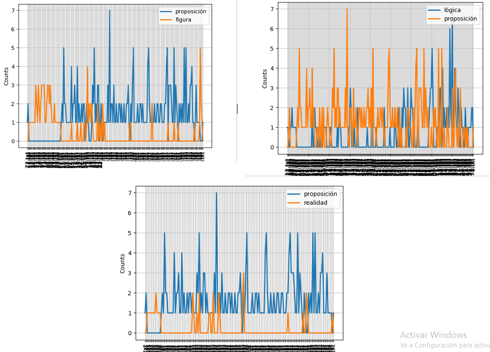  

## 9. Bigramas

Un bigrama es un grupos de dos letras, dos sílabas, o dos palabras. Son utilizados comúnmente como base para el análisis estadístico de un texto. Ayudan a calcular la probabilidad condicional de una palabra dada la palabra precedente. Es decir, evidencia aquellas palabras que tienen una fuerte dependencia mutua.

Mediante el [el siguiente script](src/tract_bigrams.py) se pueden calcular y visualizar

¿Cuales son los bigramas mas frecuentes usando [PMI](https://en.wikipedia.org/wiki/Pointwise_mutual_information) como medida de ascociación?

('leaves', 'open')  
('who', 'understands')  
('successive', 'applications')  
('infinitely', 'many')  
('visual', 'field')  
('natural', 'sciences')  
('rule', 'governing')  
('new', 'device')  
('natural', 'science')  
('mathematical', 'multiplicity')  

Y de forma cruda:

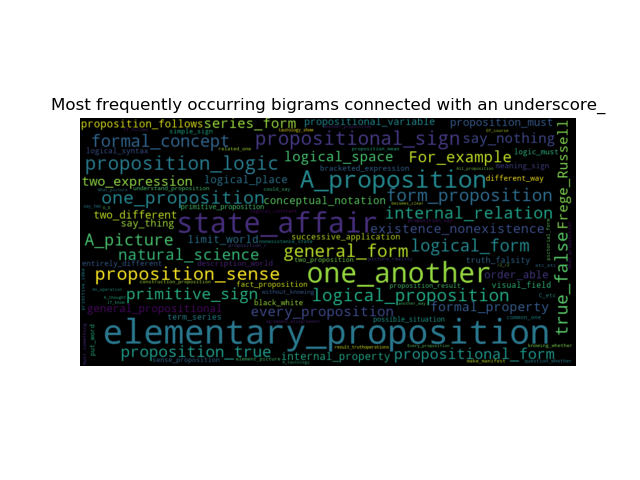 

¿Y los menos frecuentes?

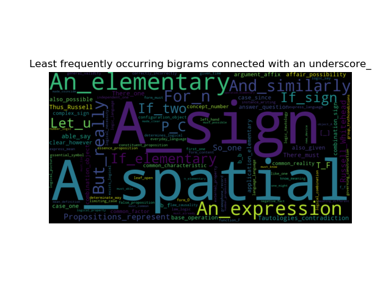 
